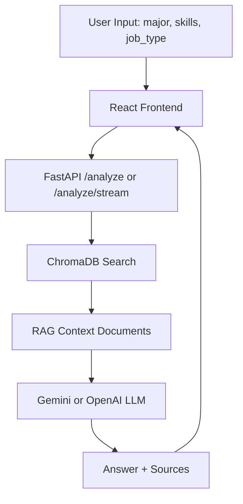

# CareerFit AI

> 취업·공모전 데이터 기반 맞춤형 AI 포트폴리오 코치

## 프로젝트 개요

CareerFit AI는 대학생과 취업 준비생이 전공, 보유 스킬, 관심 직무를 기준으로 현재 역량을 점검하고 다음 준비 방향을 설계할 수 있도록 돕는 웹 서비스입니다. 채용 공고와 공모전 정보는 많지만, 개인이 직접 요구 역량을 비교하고 부족한 부분을 판단하기는 어렵습니다.

CareerFit AI는 CSV 채용 공고 데이터를 전처리한 뒤 ChromaDB에 저장하고, 사용자의 입력과 관련 있는 공고를 RAG 방식으로 검색합니다. 검색된 공고를 Gemini 또는 OpenAI 기반 LLM 프롬프트에 함께 제공해, 실제 데이터 출처에 근거한 맞춤형 포트폴리오 조언을 생성합니다.

## 기술 스택

| 영역 | 기술 |
|---|---|
| 백엔드 | Python 3.11, FastAPI |
| AI API | Gemini 2.5 Flash-Lite, OpenAI fallback |
| 데이터 | Pandas, SQLite, ChromaDB |
| 프론트엔드 | React, Vite |
| 실행 환경 | Docker, Render |

## 아키텍처

```text
User
  ↓
React / Vite Frontend
  ↓  EventSource 또는 API 요청
FastAPI Backend
  ↓
ChromaDB Retriever
  ↓
RAG Prompt Builder
  ↓
Gemini / OpenAI LLM
  ↓
AI 분석 결과 + sources
```



## 실행 방법

### Docker로 실행

```bash
# 1. 이미지 빌드
docker build -t careerfit-ai ./backend

# 2. 컨테이너 실행
docker run -p 8000:8000 --env-file backend/.env careerfit-ai
```

API 문서:

```text
http://localhost:8000/docs
```

헬스체크:

```text
http://localhost:8000/health
```

### 로컬 백엔드 실행

```bash
cd backend

# python -m venv venv
source venv/bin/activate
# Windows: venv\Scripts\activate

# pip install -r requirements.txt
uvicorn main:app --reload --port 8000
```

### 로컬 프론트엔드 실행

```bash
cd frontend
cp .env.example .env
npm install
npm run dev
```

프론트엔드:

```text
http://localhost:5173
```

프론트엔드 환경변수:

```env
VITE_API_BASE_URL=http://localhost:8000
```

## 데이터 파이프라인

```text
CSV → Pandas 전처리 → SQLite 구조화 저장 → RAG 문서 변환 → ChromaDB 벡터 검색
```

전처리 실행:

```bash
cd backend
python data/preprocess.py
```

주요 데이터 파일:

- `backend/data/jobs.csv`
- `backend/data/preprocess.py`
- `backend/data/rag_documents.json`
- `backend/data/careerfit.db`

## 주요 기능

- RAG 기반 역량 분석: 취업 공고 데이터를 근거로 맞춤형 조언 제공
- 출처 표시: 어떤 공고 데이터를 참고했는지 `sources`로 함께 반환
- SSE 스트리밍: `/analyze/stream`으로 ChatGPT 스타일 타이핑 응답 제공
- Mock Mode: API 한도 초과 시 `MOCK_MODE=true`로 폴백 가능
- 모델 전환: `LLM_MODEL`로 Gemini, OpenAI, Ollama, Hugging Face 계열 모델 선택 가능
- Docker 배포: 백엔드 Dockerfile과 프론트엔드 Dockerfile 구성
- Render 배포: 백엔드와 프론트엔드를 각각 Web Service로 배포 가능

## API

| Method | Endpoint | 설명 |
|---|---|---|
| GET | `/health` | 서버 상태 확인 |
| GET | `/jobs` | 공고 목록 조회 |
| GET | `/jobs/{job_id}` | 특정 공고 상세 조회 |
| POST | `/analyze` | RAG 기반 역량 분석 |
| GET/POST | `/analyze/stream` | SSE 기반 스트리밍 분석 |

요청 예시:

```json
{
  "major": "통계학과",
  "skills": ["Python", "SQL"],
  "job_type": "데이터 분석"
}
```

응답 예시:

```json
{
  "answer": "현재 역량 평가와 추천 준비 방향...",
  "sources": [
    {
      "company": "핀사이트랩",
      "title": "금융 데이터 분석가",
      "job_type": "데이터 분석",
      "distance": 0.42
    }
  ]
}
```

## 프로젝트 구조

```text
careerfit-ai/
├── backend/
│   ├── main.py
│   ├── routers/
│   ├── services/
│   ├── data/
│   ├── Dockerfile
│   └── .env.example
├── frontend/
│   ├── src/
│   ├── Dockerfile
│   ├── nginx.conf
│   └── .env.example
├── docs/
│   ├── CHECKLIST.md
│   ├── EVAL_QUESTIONS.md
│   └── render-frontend-deploy.md
└── harness/
    ├── agents/
    └── skills/
```

## 환경변수

### 백엔드

```env
GEMINI_API_KEY=your_gemini_api_key_here
OPENAI_API_KEY=your_openai_api_key_here
MOCK_MODE=false
LLM_MODEL=gemini-2.5-flash-lite
FRONTEND_ORIGINS=http://localhost:5173,http://127.0.0.1:5173,https://your-frontend-service.onrender.com
```

### 프론트엔드

```env
VITE_API_BASE_URL=http://localhost:8000
```

실제 `.env` 파일은 GitHub에 올리지 않습니다. 예시 파일만 커밋합니다.

## 배포

백엔드는 Docker 기반 Render Web Service로 배포합니다. ChromaDB가 컨테이너 내부에서 `chroma_db` 디렉토리를 생성하므로, Dockerfile에서 비루트 사용자 권한과 디렉토리 소유권을 함께 처리합니다.

프론트엔드는 React/Vite 빌드 결과물을 Nginx로 서빙하는 Docker 기반 Render Web Service로 배포합니다.

자세한 프론트엔드 Render 배포 방법:

```text
docs/render-frontend-deploy.md
```

Render 환경변수:

- 프론트엔드: `VITE_API_BASE_URL`
- 백엔드: `FRONTEND_ORIGINS`, `GEMINI_API_KEY`, 필요 시 `OPENAI_API_KEY`

## 검증 체크리스트

- [x] FastAPI `/health` 동작 확인
- [x] `/jobs` 목업 응답 확인
- [x] CSV 전처리 및 SQLite 저장 확인
- [x] RAG 문서 변환 확인
- [x] ChromaDB 검색 확인
- [x] `/analyze` RAG 응답 확인
- [x] `/analyze/stream` SSE 응답 확인
- [x] React 입력 폼, 결과 카드, 출처 카드 구현
- [x] Dockerfile 작성 및 Render 배포 대응
- [x] `.env`와 API Key GitHub 미포함 확인

## 향후 개선

- [ ] 이력서 PDF 업로드 후 자동 역량 추출
- [ ] 공모전 마감일 알림 기능
- [ ] RAG 검색 품질 평가 지표 추가
- [ ] 사용자별 포트폴리오 히스토리 저장
- [ ] 채용 공고 데이터 자동 수집 파이프라인 구축

## 개발 과정

가장 어려웠던 부분은 LLM 응답을 단순 호출이 아니라 실제 공고 데이터에 근거한 RAG 응답으로 연결하는 과정이었습니다. ChromaDB 검색 결과를 프롬프트에 함께 넣고, 프론트엔드에서는 SSE로 응답을 스트리밍해 사용자가 분석 과정을 자연스럽게 볼 수 있도록 개선했습니다.

또한 Docker 배포 과정에서 비루트 사용자 실행과 ChromaDB 저장 디렉토리 권한 문제가 발생했지만, `/app/chroma_db` 디렉토리 생성과 소유권 설정을 Dockerfile에 반영해 Render 환경에서도 실행 가능하도록 수정했습니다.

---

## Demo

- Live Demo: https://your-service-url.com
- API Docs: https://your-backend-service.onrender.com/docs

---

## Developer

- Name: Hojin cho
- Role: AI Service Development
- GitHub: @sumb-10
- Email: saku07891@gmail.com
